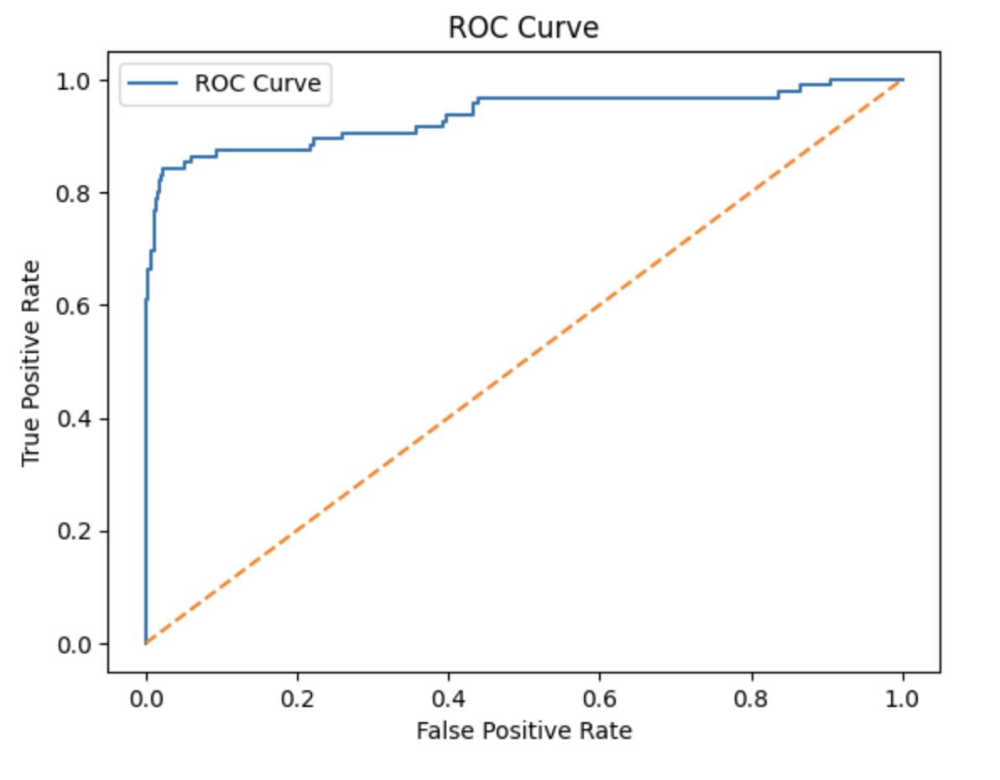
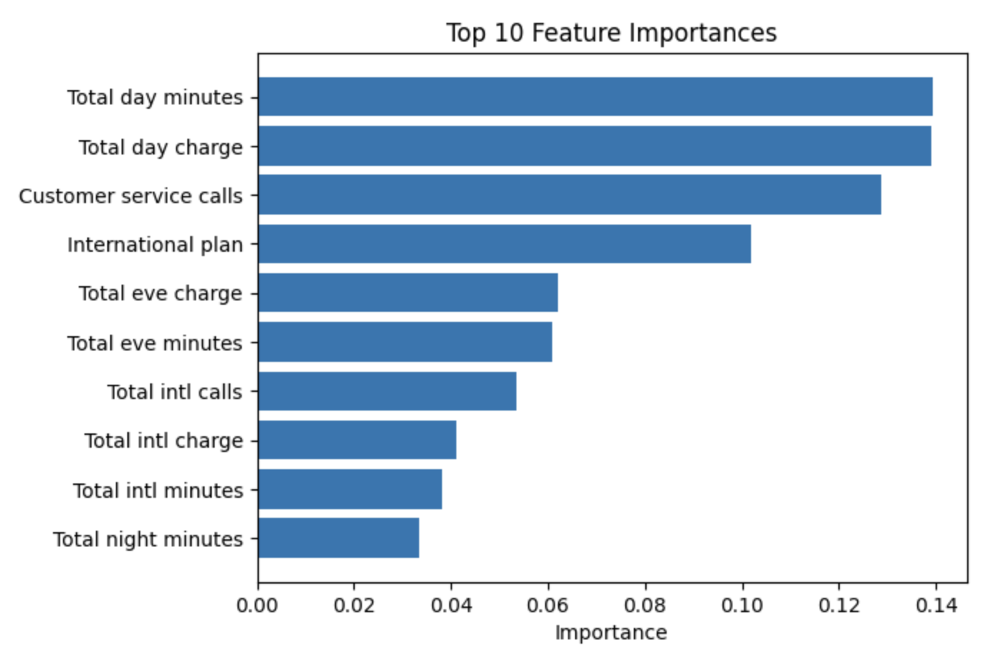

# Customer Churn Prediction

A machine learning project that predicts telecom customer churn using Python and Random Forest. The project includes data preprocessing, feature encoding, model training, and performance evaluation.

## Objective
The aim of this project is to identify customers at risk of leaving a telecom service based on customer account and usage data.

## Technologies Used
- Python
- Pandas
- NumPy
- Scikit-learn
- Matplotlib
- Jupyter Notebook

## Results
- Accuracy: 94.6%
- ROC-AUC: 0.93

## Visualisations

## Business Value
This project helps organisations identify customers with high churn risk and supports targeted retention strategies, reducing revenue loss and improving customer satisfaction.
